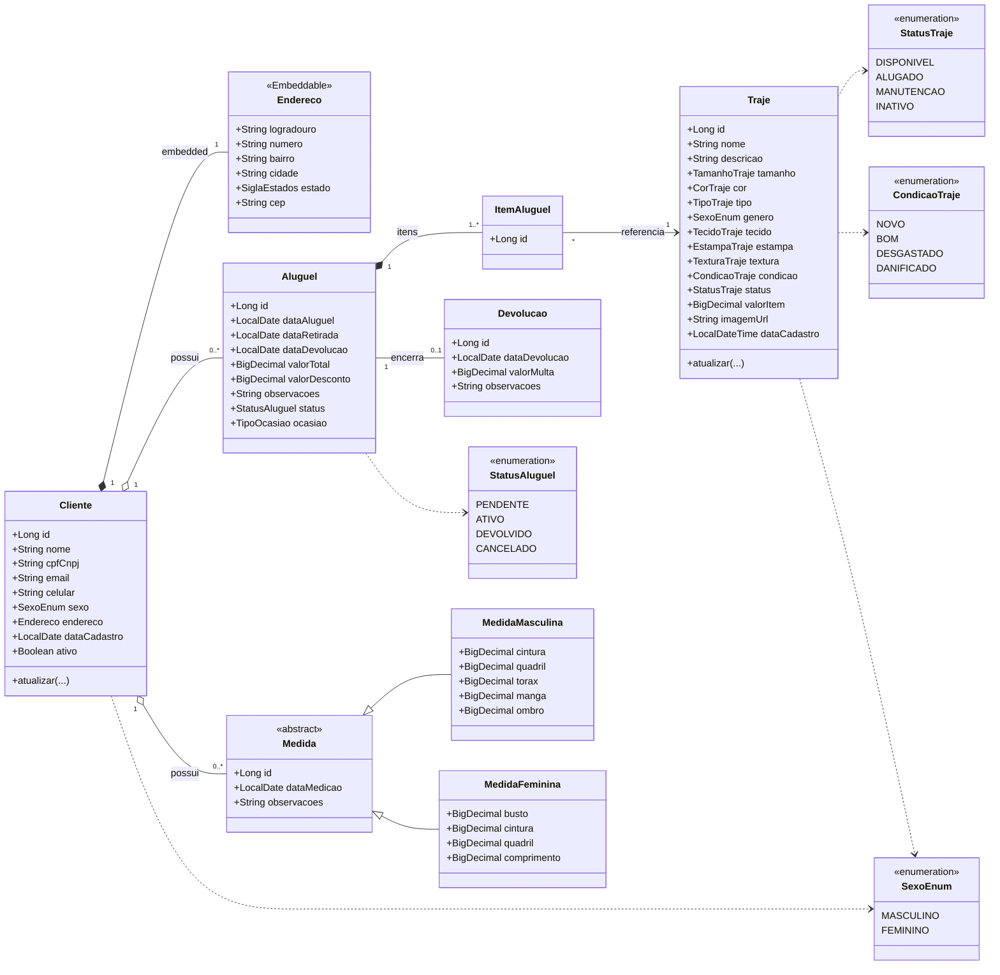
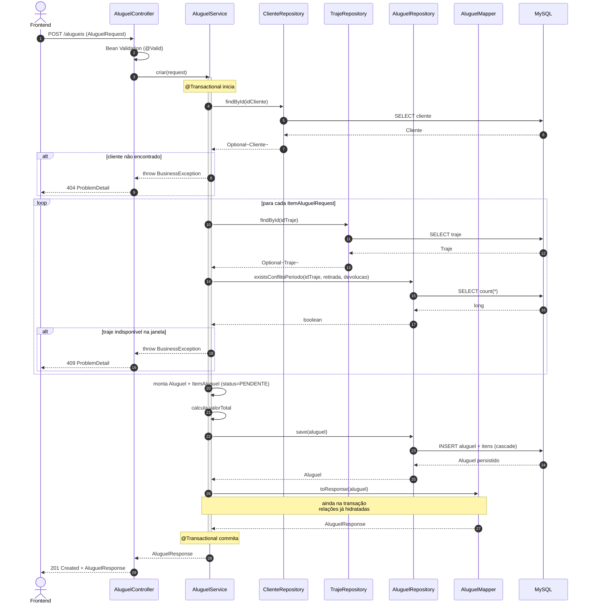

# Arquitetura — Celidone

Documento de referência para entender as decisões arquiteturais do **Celidone**, um backend Spring Boot 3.4 / Java 21 que apoia a operação de uma locadora de trajes a rigor (TCC FATEC). O foco é explicar **o que existe** e **por que existe**, para que futuras mudanças preservem a coerência do sistema ou — quando necessário — revertam decisões de forma consciente.

---

## 1. Visão geral

### 1.1 Domínio

O sistema gerencia o ciclo de vida de aluguéis de trajes formais:

- **Clientes** cadastram-se (PF ou PJ) e podem ter **medidas** registradas.
- **Trajes** compõem o catálogo, com atributos (cor, tecido, tamanho, etc.) e estado (`StatusTraje`).
- **Aluguéis** referenciam um cliente e contêm vários **itens** (cada item aponta para um traje e um período).
- **Devoluções** encerram o ciclo, podendo registrar a condição de retorno por item.
- **Contratos** em PDF são gerados sob demanda a partir de um aluguel.

### 1.2 Stack

| Camada     | Tecnologia                                |
|------------|-------------------------------------------|
| Linguagem  | Java 21 (compatível com Java 17 no CI)    |
| Framework  | Spring Boot 3.4 (Web, Data JPA, Security, Validation, Actuator) |
| Persistência | Hibernate / Spring Data JPA            |
| Banco prod | MySQL 8 (via `docker-compose`)            |
| Banco test | H2 in-memory (perfil `test`)              |
| Build      | Gradle (Kotlin/Groovy DSL)                |
| Docs API   | springdoc-openapi 2.x                     |
| Testes     | JUnit 5, Mockito, MockMvc, Cucumber       |
| Cobertura  | JaCoCo + PIT (mutation testing)           |

### 1.3 Convenções gerais

- **Idioma do domínio:** português. Nomes de classes, métodos, mensagens e features Cucumber seguem o domínio (`Cliente`, `Aluguel`, `registrarDevolucao`).
- **Idioma do código técnico:** inglês para anotações, Spring, Java padrão.
- **Commits:** mensagem em português, padrão Conventional Commits (`feat(aluguel): ...`).

---

## 2. Estrutura de pacotes

```
br.edu.fateczl.tcc
├── controller/      REST endpoints — boundary HTTP
├── service/         Regras de negócio — onde a cobertura é cobrada
├── repository/      Spring Data JPA (interfaces)
├── specification/   JPA Criteria reutilizável (filtros dinâmicos)
├── domain/          Entidades JPA + factory de Cliente
├── dto/             Requests/Responses por contexto
├── mapper/          Conversão entity ⇄ DTO
├── strategy/        Strategy para Medida (masculina/feminina)
├── enums/           Enumerações de domínio + util de display
├── exception/       BusinessException, NotFound + handler global
├── config/          Spring Security, Swagger, Jackson, EnumConverter
└── util/            Utilitários (PortUtil)
```

A regra é: **dependências fluem de fora para dentro** — controller depende de service, service depende de repository, e nunca o inverso. DTOs vivem na borda (controller); entidades JPA não atravessam o controller.

---

## 3. Decisões arquiteturais

Cada decisão é descrita como **Contexto → Decisão → Consequências**, no espírito de ADRs leves.

### 3.1 Camadas clássicas (controller → service → repository → domain)

- **Contexto:** projeto de TCC com escopo CRUD-pesado e complexidade de regra concentrada em poucos pontos (aluguel/devolução). Time pequeno, foco em didática.
- **Decisão:** adotar a arquitetura em camadas clássica do Spring, sem hexagonal/clean/CQRS. Service é o único lugar onde regra de negócio mora; controller só orquestra HTTP; repository é interface JPA.
- **Consequências:**
  - Curva de aprendizado baixa para a banca e para colegas.
  - Risco de "service gordo" — mitigado por extração de Strategy e Specification quando a complexidade aparece.
  - Cobertura JaCoCo e PIT são cobradas só em `service.*` e `controller.*` — o resto é considerado mecânico.

### 3.2 Entidades JPA + DTOs explícitos com mappers manuais

- **Contexto:** evitar exposição de entidades JPA na resposta HTTP (vazamento de relacionamentos LAZY, ciclos JSON, mudanças no schema quebrando contrato).
- **Decisão:** cada agregado tem `Request`, `Response` e, quando preciso, `UpdateRequest` separados (`dto/aluguel/...`, `dto/cliente/...`). Mappers ficam em `mapper/` e são escritos à mão (não usamos MapStruct apesar do estilo se assemelhar).
- **Consequências:**
  - Boilerplate ao adicionar campo novo (DTO + mapper).
  - Liberdade total para moldar o contrato HTTP independente do schema.
  - **Pegada importante:** o mapper roda fora da transação do service. Como `spring.jpa.open-in-view: false`, qualquer relacionamento LAZY tocado no mapper estoura `LazyInitializationException`. Resolver carregando os dados ainda dentro do método transacional (fetch join, `@EntityGraph` ou hidratação explícita).

### 3.3 `Specification` para filtros dinâmicos

- **Contexto:** endpoints como `/alugueis` e `/trajes` aceitam combinações opcionais de filtros (status, intervalo de datas, cliente, etc.). Repository methods nomeados explodem em variantes.
- **Decisão:** usar `JpaSpecificationExecutor` + classes utilitárias em `specification/` (`AluguelSpecification`, `TrajeSpecification`, `MedidaSpecification`). Cada método estático devolve uma `Specification<T>` ou `null` quando o filtro não foi informado, e o service compõe via `Specification.where(a).and(b)`.
- **Consequências:**
  - Filtros novos custam um método estático isolado e uma linha no service — adições não inflam métodos existentes.
  - É preciso disciplina: quando aparece `if (param != null) ...` inline no service, é sinal de que a Specification foi esquecida. (Atualmente `TrajeService.buscar` viola isso — ver `possiveis-melhorias.md` 1.3.)
  - Quando reaplicar: sempre que um endpoint de listagem aceitar dois ou mais filtros opcionais.

### 3.4 Herança JOINED em `Medida`

- **Contexto:** medidas masculinas e femininas compartilham metadados (cliente, data, observações) mas têm campos de corpo distintos.
- **Decisão:** `Medida` é abstrata (`@Inheritance(strategy = JOINED)`) e tem duas filhas concretas: `MedidaMasculina` e `MedidaFeminina`. Cada filha tem seu próprio `Repository` e seus próprios DTOs.
- **Consequências:**
  - Schema bonito (uma tabela por filha + a tabela base) e sem colunas nulas inúteis.
  - Custo de JOIN em consultas que listam medidas pelo pai. Aceitável dado o volume esperado.
  - Pluralidade exige Strategy (próximo item).

### 3.5 Strategy de medida

- **Contexto:** ao criar/atualizar uma medida, o service precisa decidir qual entidade construir (`MedidaMasculina` x `MedidaFeminina`) com base em `SexoEnum` do cliente. Um `if/else` central seria frágil quando aparecesse uma terceira variante (ou validações específicas por sexo).
- **Decisão:** `MedidaStrategy` é uma interface com duas implementações (`MedidaMasculinaStrategy`, `MedidaFemininaStrategy`). `MedidaService` injeta a lista de strategies e seleciona pela `SexoEnum`.
- **Consequências:**
  - Adicionar nova variante = nova classe Strategy + DTO + mapper, sem mexer no service.
  - Se a quantidade de variantes ficar em duas para sempre, é overengineering moderado — mas o ganho é didático (TCC).

### 3.6 `Cliente` com `Endereco` `@Embeddable`

- **Contexto:** endereço é parte intrínseca do cliente (PF ou PJ), nunca consultado isoladamente.
- **Decisão:** `Endereco` é `@Embeddable` e está embutido em `Cliente`, não em tabela separada.
- **Consequências:**
  - Persistência simples e leitura sem JOIN.
  - Se algum dia um cliente puder ter múltiplos endereços (cobrança vs. entrega), promover `Endereco` a entidade.

### 3.7 `BusinessException` + `GlobalExceptionHandler`

- **Contexto:** padronizar respostas de erro e desacoplar regras de negócio de detalhes HTTP.
- **Decisão:** services lançam `BusinessException` (ou `ResourceNotFoundException`) com mensagem em português; o `GlobalExceptionHandler` converte em `ProblemDetail`/JSON com status apropriado. Validações Bean Validation viram 400 automaticamente.
- **Consequências:**
  - Contratos de erro consistentes na API.
  - **Pegada conhecida:** o handler hoje decide o status HTTP via `String.contains` na mensagem — ver `possiveis-melhorias.md` 2.1. A direção é introduzir hierarquia (`NotFoundException`, `ConflictException`) ou um campo `code`.

### 3.8 Segurança aberta por padrão

- **Contexto:** o TCC ainda não tem requisito de autenticação implementado; o frontend roda em `localhost`.
- **Decisão:** `SecurityConfig` libera todas as rotas (`permitAll`), desabilita CSRF e configura CORS para portas conhecidas do frontend (`5173`, `5174`, `3000`).
- **Consequências:**
  - **Não usar em produção.** O config existe para destravar o desenvolvimento, não como postura final.
  - Quando autenticação for adotada, ver `possiveis-melhorias.md` 3.1 — a direção provável é JWT por simplicidade.

### 3.9 `open-in-view: false`

- **Contexto:** o anti-pattern OSIV mantém a sessão Hibernate aberta durante a renderização da view, mascarando lazy-loads que deveriam ser explícitos.
- **Decisão:** desabilitar (`application.yaml:22`) para forçar quem escreve service a pensar no que precisa ser carregado.
- **Consequências:**
  - Toda navegação de relacionamento LAZY fora da transação quebra. **Isso é intencional** — sinaliza que o mapper/controller está acessando algo que o service deveria ter trazido.
  - Custo: cuidado adicional ao escrever mappers (ver 3.2).

### 3.10 Schema via `ddl-auto: update` (sem migrations)

- **Contexto:** projeto acadêmico, schema evolui rápido durante o desenvolvimento.
- **Decisão:** deixar o Hibernate atualizar o schema (`spring.jpa.hibernate.ddl-auto: update`).
- **Consequências:**
  - Iteração rápida, sem fricção.
  - Sem rastro versionado das mudanças, sem rollback, schema de produção vira caixa-preta.
  - **Direção declarada:** adotar Flyway antes de qualquer deploy real (`possiveis-melhorias.md` 4.1).

### 3.11 Estratégia de testes em três camadas

- **Contexto:** o TCC valoriza demonstrar técnica de teste; o sistema tem regras suficientes para justificar mais que uma camada.
- **Decisão:**
  1. **Unitário (JUnit + Mockito)** para services e mappers. Services seguem o **padrão TFS** (Teste Funcional Sistemático = PCE + AVL): cabeçalho do `*ServiceTest` traz a matriz de classes de equivalência e bordas; cada caso é numerado `CTn`. Referência: `TrajeServiceTest`, `AluguelServiceTest`.
  2. **Integração (`@SpringBootTest` + MockMvc)** para controllers, no perfil `test` (H2 in-memory). Cada controller tem um par `*ControllerTest` (unitário) + `*ControllerIntegrationTest`.
  3. **BDD (Cucumber)** para cenários voltados à banca, hoje cobrindo apenas `Cliente`. Entry point: `CucumberTest`. Glue Spring: `bdd.steps.CucumberSpringConfiguration`.
- **Consequências:**
  - TFS dá rastreabilidade entre requisitos e testes — útil para a defesa do TCC.
  - Custo: redundância entre camadas. Aceito porque cada camada testa um risco diferente (lógica, contrato HTTP, cenário de usuário).
  - Cobertura cobrada apenas em `service.*` e `controller.*` (JaCoCo: 80% linha / 60% branch). PIT roda em `service.*` com threshold 60%.

### 3.12 Fixtures via TestDataBuilders

- **Contexto:** entidades têm muitos campos obrigatórios; cada teste recriando manualmente vira ruído.
- **Decisão:** builders fluentes em `src/test/java/br/edu/fateczl/tcc/util/` (`ClienteTestDataBuilder`, `AlugueisDataBuilder`, `TrajeTestFactory`, etc.), com defaults plausíveis e métodos `comX(...)` para sobrescrever.
- **Consequências:**
  - Setup curto e legível.
  - Builder mantém o teste estável quando o domínio ganha novos campos.
  - Regra: testes novos **devem** usar builders existentes em vez de recriar `new Cliente(...)` à mão.

---

## 4. Fluxos críticos

### 4.1 Criar aluguel

1. `POST /alugueis` recebe `AluguelRequest`.
2. `AluguelController` delega a `AluguelService.criar`.
3. Service valida cliente existente, valida cada `ItemAluguelRequest` (período, traje disponível na janela), monta entidades e persiste em uma única transação.
4. `AluguelMapper.toResponse` constrói `AluguelResponse` — dados precisam estar carregados antes de sair da transação (ver 3.2).

### 4.2 Registrar devolução

1. `POST /alugueis/{id}/devolucao` com `DevolucaoRequest`.
2. `AluguelService.registrarDevolucao` busca o aluguel, valida estado (`StatusAluguel`), itera pelos itens devolvidos, atualiza condição de cada traje (`CondicaoTraje`), grava `Devolucao` e atualiza status do aluguel.
3. **Atomicidade:** toda a operação deve ocorrer dentro de uma única transação. (Item 1.2 das melhorias.)

### 4.3 Listar com filtros (Aluguel/Traje/Medida)

1. Controller recebe um `FiltroRequest` (ex.: `AluguelFiltroRequest`).
2. Service compõe `Specification` via classes utilitárias em `specification/`.
3. Repository, herdando `JpaSpecificationExecutor`, executa.
4. Mapper devolve a lista de responses.

---

## 5. Dependências externas e configuração

- **`.env`** (carregado por `io.github.cdimascio:java-dotenv` em `TccApplication`) fornece `DB_USERNAME`, `DB_PASSWORD`, `DB_HOST`, etc. Há um `.env.example` para servir de template.
- **Perfis:** `default` (MySQL via `.env`) e `test` (H2 in-memory + `ddl-auto: create-drop`, em `src/test/resources/application-test.yaml`).
- **Swagger/OpenAPI:** `SwaggerConfig` define o título e a descrição da API. UI em `/swagger-ui.html`. Documentação por operação ainda é parcial — ver `possiveis-melhorias.md` 7.1.
- **CORS:** lista de origens dev definida em `SecurityConfig`. Não há separação por perfil.

---

## 6. Quando reaplicar cada decisão

| Padrão                        | Reaplicar quando…                                                                 |
|-------------------------------|------------------------------------------------------------------------------------|
| Specification                 | Listagem com 2+ filtros opcionais.                                                 |
| Strategy                      | Comportamento varia por enum/discriminador e há ≥2 variantes com lógica distinta. |
| `@Embeddable`                 | Conjunto de campos sempre acessado junto com a entidade pai e nunca isolado.       |
| DTO + mapper dedicado         | Sempre que algo cruza a fronteira HTTP. Sem exceções — não exponha entidades.      |
| TestDataBuilder               | A entidade tem 5+ campos obrigatórios ou aparece em 3+ testes.                     |
| TFS no service test           | O método tem múltiplas classes de equivalência ou bordas (datas, status, valores). |
| Herança JOINED                | Hierarquia real de domínio com schema heterogêneo. Para variação leve, prefira enum + colunas opcionais. |

---

## 7. Antipadrões a evitar

- **Acessar relacionamentos LAZY no controller ou no mapper sem hidratá-los antes.** O `open-in-view: false` é proposital — fetch deve ser explícito no service.
- **Lançar `RuntimeException` cru.** Use `BusinessException` ou `ResourceNotFoundException` para que o `GlobalExceptionHandler` consiga responder com status correto.
- **Inflar o service com `if` de filtro.** Crie um método em `*Specification` e componha.
- **Construir entidades manualmente em testes novos.** Use o builder; se não existir um adequado, estenda o existente.
- **Esquecer `@Valid` em listas/objetos aninhados em DTOs.** Bean Validation não desce sem ele.
- **Misturar autenticação com regra de negócio antes de a autenticação existir.** Quando ela for introduzida, o ponto de injeção previsto é o `SecurityFilterChain` em `SecurityConfig`, e a propagação do usuário será via `SecurityContext`.

---

## 8. Diagramas

### 8.1 Diagrama de classes — domínio

Foco nas entidades JPA do agregado central. Atributos triviais foram suprimidos para legibilidade; os enums aparecem como classes para sinalizar os contratos de valor.



### 8.2 Diagrama de sequência — criação de um aluguel

Cobre o caminho feliz de `POST /alugueis` (cliente válido, trajes disponíveis na janela). Camadas envolvidas: controller, service, mapper, repositórios JPA e banco.



---

## 9. Para onde ir a partir daqui

- Backlog de evolução técnica: `possiveis-melhorias.md` (na raiz do projeto).
- Convenções de desenvolvimento: `CLAUDE.md` (na raiz, voltado à automação de IDE).
- Configuração de cobertura/mutação: `build.gradle` (blocos `jacoco`, `jacocoTestCoverageVerification`, `pitest`).
- Runbook local: `README.md` (setup com `.env` + `docker compose up -d` + `./gradlew bootRun`).
